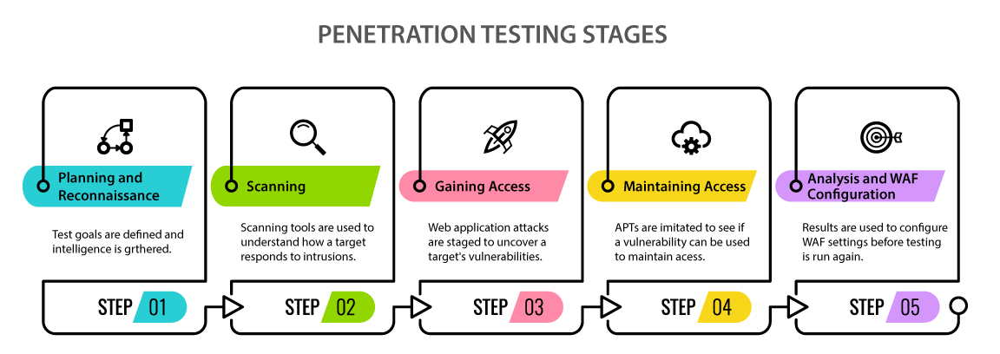

# Ethical Hacking

## Phases

From CEH ECC website:



## Interesting links




Becoming a super hero is a fairly straight forward process:

```
$ give me super-powers
```


 Super-powers are granted randomly so please submit an issue if you're not happy with yours.



